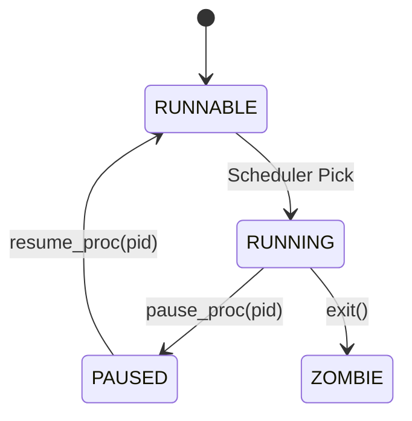
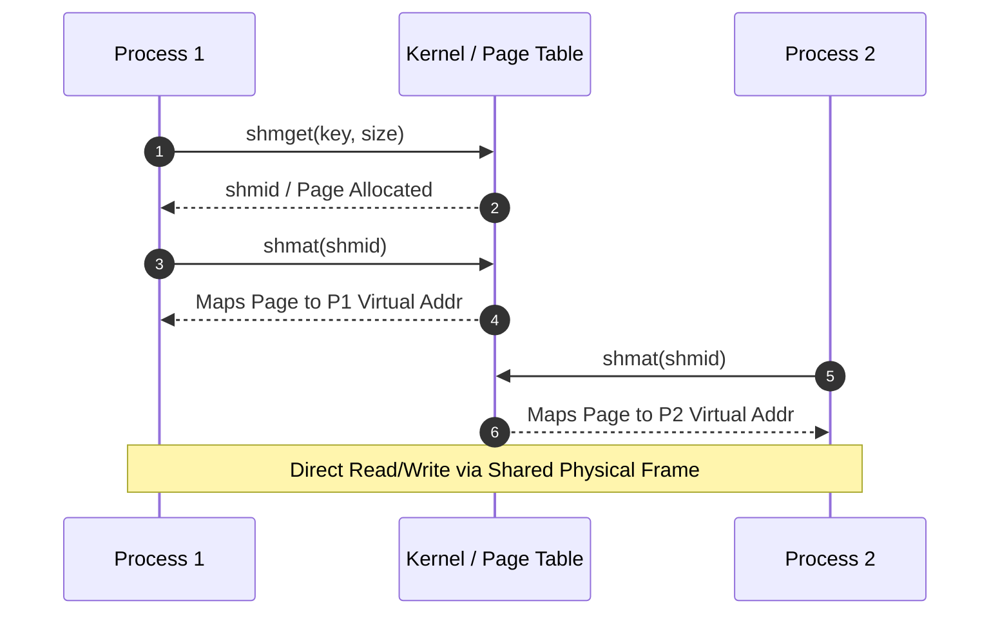
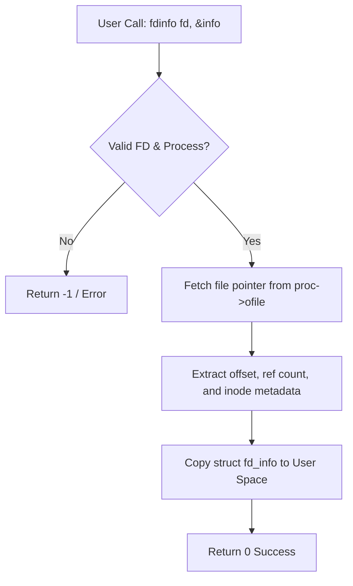
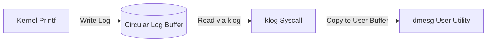
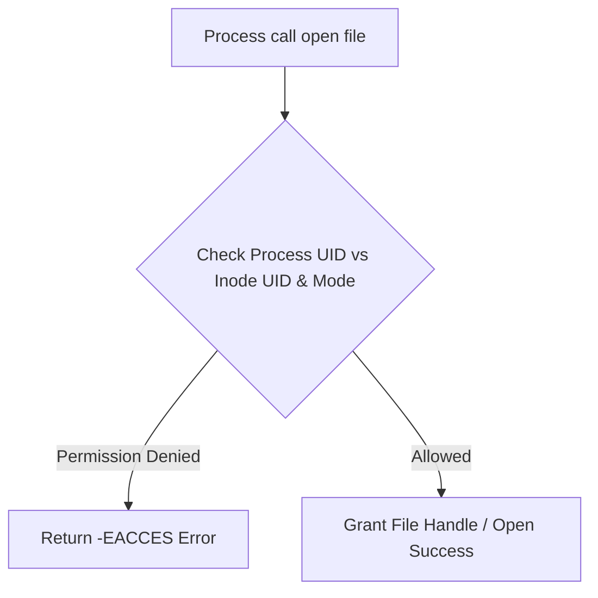
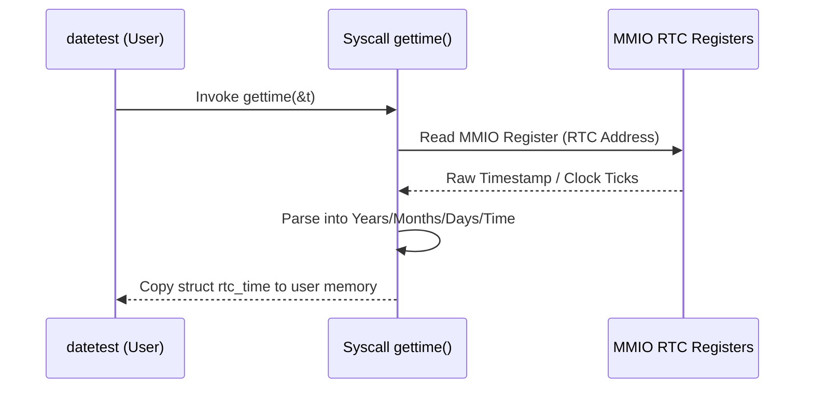
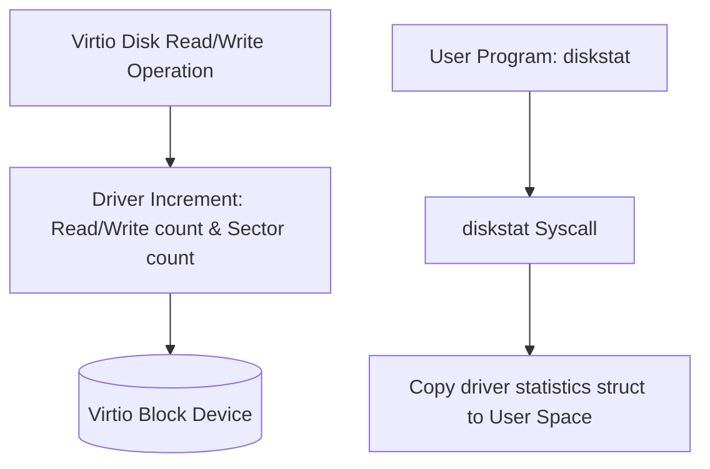
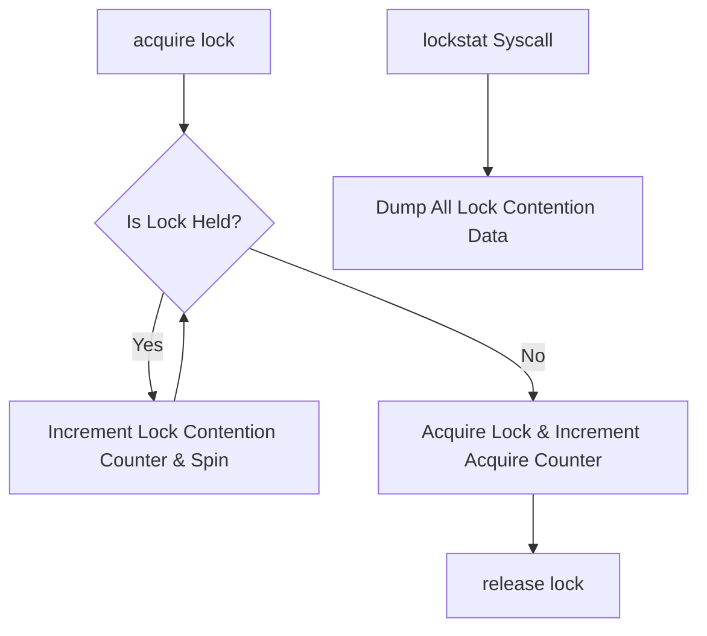
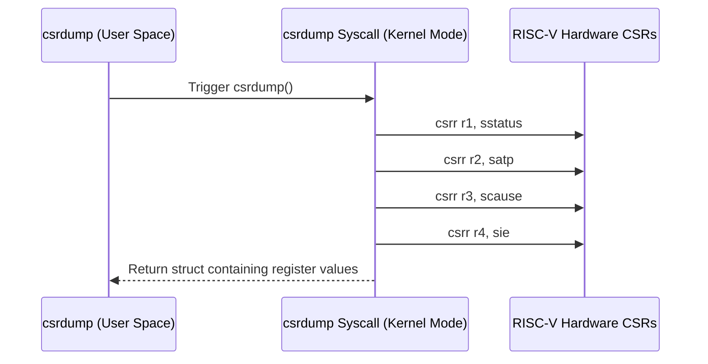
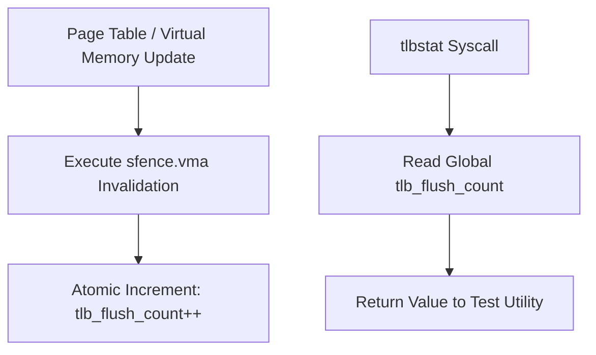

# Kernel-Extend-Project

## Student Information

**Name:** Manahil Rehman
**Roll No:** BCS-F24-E09

**Project:** Operating System/ Computer Archeitecture Kernel Extension

**Base Kernel:** xv6-riscv

---

## Selected Modules

The following modules have been selected for my kernel extension project.

### Part 1: OS Modules — Multitasking

| # | Module | Subsystem | Syscalls | Test Program | Difficulty |
|---|--------|-----------|----------|--------------|------------|
| 1 | **Process Pause/Resume** | Process States | `pause_proc()`, `resume_proc()` | `pausetest` | Easy-medium |
| 2 | **Shared Memory** | Pages Mapped into Two Processes | `shmget()`, `shmat()`, `shmdt()` | `shmtest` | Medium |
| 3 | **File Descriptor Info** | Open-File Table | `fdinfo()` | `fdinfo` | Easy |
| 4 | **Kernel Log Buffer (dmesg)** | Kernel Logging | `klog()` | `dmesg` | Easy-medium |
| 5 | **User IDs and File Permissions** | Access Control | `setuid()`, `getuid()`, `chmod()` | `permtest` | Medium |

### Part 2: Architecture Modules — RISC-V

| # | Module | Subsystem | Syscalls | Test Program | Difficulty |
|---|--------|-----------|----------|--------------|------------|
| 6 | **Real-Time Clock** | Memory-Mapped I/O (QEMU RTC) | `gettime()` | `datetest` | Easy-medium |
| 7 | **Virtio Disk Statistics** | Disk Driver | `diskstat()` | `diskstat` | Easy |
| 8 | **Lock Statistics** | Atomics and Spinlocks | `lockstat()` | `lockstattest` | Medium |
| 9 | **CSR Dump** | Supervisor CSRs (`sstatus`, `satp`, `scause`, `sie`) | `csrdump()` | `csrdump` | Easy |
| 10 | **TLB Flush Counter** | `sfence.vma` and Address Translation | `tlbstat()` | `tlbstat` | Medium |

---

## Module Reservation

**These 10 modules are reserved for my kernel extension project.**

Implementation, testing, documentation, and architectural diagrams will be added in later stages.

# Detailed Module Specifications & Flow Diagrams

---

## Module 1: Process Pause/Resume
* **Subsystem:** Process States
* **Syscalls:** `pause_proc()`, `resume_proc()`
* **Test Program:** `pausetest`
* **Difficulty:** Easy-medium

### Explanation & Key Features
* **Overview:** Adds execution control capabilities to temporarily suspend (pause) and resume process execution by introducing a dedicated process state (`PAUSED`).
* **Key Features:**
  * Introduces a new process state `PAUSED` in the kernel's process control block (PCB) structure.
  * System call `pause_proc(pid)` transitions a target process from `RUNNING` or `RUNNABLE` to `PAUSED` state and triggers the kernel scheduler.
  * System call `resume_proc(pid)` restores a paused process back to the `RUNNABLE` state.
  * Ensures race-condition-free state transitions within kernel execution context.

### Flow Diagram

---

## Module 2: Shared Memory
* **Subsystem:** Pages Mapped into Two Processes
* **Syscalls:** `shmget()`, `shmat()`, `shmdt()`
* **Test Program:** `shmtest`
* **Difficulty:** Medium

### Explanation & Key Features
* **Overview:** Facilitates high-speed Inter-Process Communication (IPC) by allowing two or more independent processes to map and share physical memory pages.
* **Key Features:**
  * Allocates physical memory pages that can be concurrently mapped into distinct user-space virtual addresses.
  * Updates system page tables so different page table entries reference the exact same physical memory frames.
  * Implements reference counting mechanisms to release physical pages once all attached processes detach.

### Flow Diagram

---

## Module 3: File Descriptor Info
* **Subsystem:** Open-File Table
* **Syscalls:** `fdinfo()`
* **Test Program:** `fdinfo`
* **Difficulty:** Easy

### Explanation & Key Features
* **Overview:** Provides inspection and diagnostic interfaces to query metadata and properties of active file descriptors owned by a process.
* **Key Features:**
  * Queries open file descriptors, file offsets, access flags, reference counts, and underlying file types (pipe, inode, or device).
  * System call `fdinfo(fd, struct fd_info *info)` populates detailed diagnostic data structures in user space.
  * Helps trace file leaks and unclosed stream handles during user-space program execution.

### Flow Diagram

---

## Module 4: Kernel Log Buffer (dmesg)
* **Subsystem:** Kernel Logging
* **Syscalls:** `klog()`
* **Test Program:** `dmesg`
* **Difficulty:** Easy-medium

### Explanation & Key Features
* **Overview:** Implements an internal circular ring buffer inside the kernel to store print log messages for runtime debugging.
* **Key Features:**
  * Fixed-size ring buffer implementation (`LOG_SIZE`) preventing memory leaks and buffer overflows.
  * Intercepts kernel `printf` outputs to concurrently capture log entries into the ring buffer.
  * System call `klog(buf, size)` exposes recorded kernel logs to userland utilities like `dmesg`.

### Flow Diagram

---

## Module 5: User IDs and File Permissions
* **Subsystem:** Access Control
* **Syscalls:** `setuid()`, `getuid()`, `chmod()`
* **Test Program:** `permtest`
* **Difficulty:** Medium

### Explanation & Key Features
* **Overview:** Establishes multi-user execution contexts and POSIX-compliant file permissions across the file system.
* **Key Features:**
  * Maintains User IDs (`uid`) inside the process state for execution control.
  * Stores owner UID and permission mode bitmasks (`rwx`) inside file inode metadata.
  * Enforces permission validation during file `open()`, `read()`, `write()`, and `execute()` calls.

### Flow Diagram

---

## Module 6: Real-Time Clock
* **Subsystem:** Memory-Mapped I/O (QEMU RTC)
* **Syscalls:** `gettime()`
* **Test Program:** `datetest`
* **Difficulty:** Easy-medium

### Explanation & Key Features
* **Overview:** Interfaces directly with hardware Memory-Mapped I/O (MMIO) registers of the Real-Time Clock on QEMU RISC-V platform.
* **Key Features:**
  * Reads raw hardware time counters mapped in system physical address space.
  * System call `gettime(struct rtc_time *t)` retrieves wall-clock hardware timestamps.
  * Translates raw hardware timer ticks into structured date, time, and calendar units.

### Flow Diagram

---

## Module 7: Virtio Disk Statistics
* **Subsystem:** Disk Driver
* **Syscalls:** `diskstat()`
* **Test Program:** `diskstat`
* **Difficulty:** Easy

### Explanation & Key Features
* **Overview:** Tracks and records Virtio block storage device usage metrics to enable disk performance analysis.
* **Key Features:**
  * Tracks total read/write request operations, cumulative sectors read/written, and device I/O errors.
  * System call `diskstat(struct disk_stats *st)` transfers low-level block driver statistics to user space.

### Flow Diagram

---

## Module 8: Lock Statistics
* **Subsystem:** Atomics and Spinlocks
* **Syscalls:** `lockstat()`
* **Test Program:** `lockstattest`
* **Difficulty:** Medium

### Explanation & Key Features
* **Overview:** Instruments kernel synchronization primitives (spinlocks and sleep-locks) to measure lock contention and performance bottlenecks.
* **Key Features:**
  * Records acquisition counts, spin-loop contention cycles, and lock hold durations for active kernel locks.
  * Assists in identifying concurrency bottlenecks and race condition hot spots.
  * System call `lockstat()` exposes kernel lock contention counters to user diagnostics.

### Flow Diagram

---

## Module 9: CSR Dump
* **Subsystem:** Supervisor CSRs (`sstatus`, `satp`, `scause`, `sie`)
* **Syscalls:** `csrdump()`
* **Test Program:** `csrdump`
* **Difficulty:** Easy

### Explanation & Key Features
* **Overview:** Interrogates RISC-V Supervisor mode Control and Status Registers (CSRs) for hardware and architectural diagnostics.
* **Key Features:**
  * Utilizes RISC-V assembly (`csrr`) instructions to fetch values of `sstatus`, `satp`, `scause`, `stval`, and `sie`.
  * Enables low-level debugging of kernel trap handlers, virtual page table pointers (`satp`), and interrupt bitmasks (`sie`).

### Flow Diagram

---

## Module 10: TLB Flush Counter
* **Subsystem:** `sfence.vma` and Address Translation
* **Syscalls:** `tlbstat()`
* **Test Program:** `tlbstat`
* **Difficulty:** Medium

### Explanation & Key Features
* **Overview:** Counts Translation Lookaside Buffer (TLB) invalidation requests issued via the RISC-V `sfence.vma` instruction.
* **Key Features:**
  * Hooks into kernel memory management and context-switching routines that invalidate virtual address translation entries.
  * Maintains atomic counters incremented every time memory mappings are modified.
  * System call `tlbstat()` returns global TLB flush operation metrics for performance analysis.

### Flow Diagram

