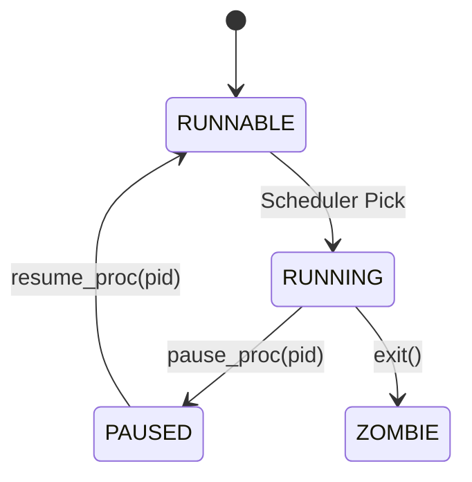
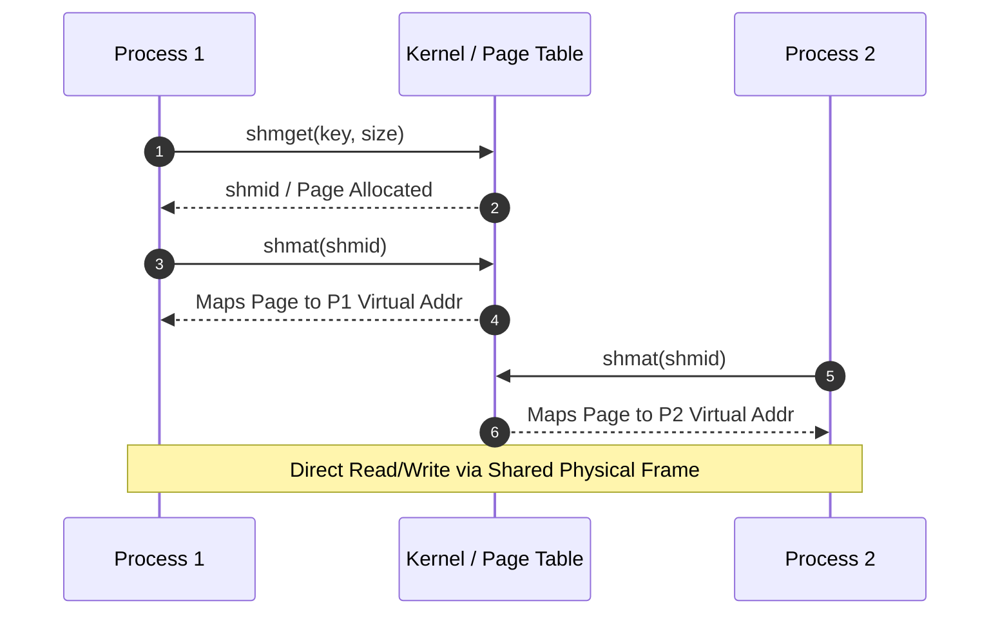
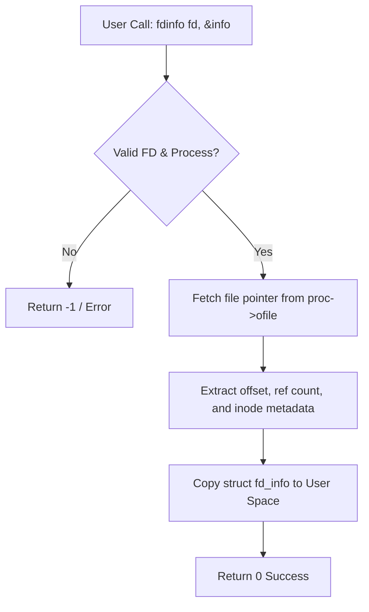
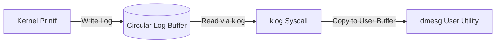
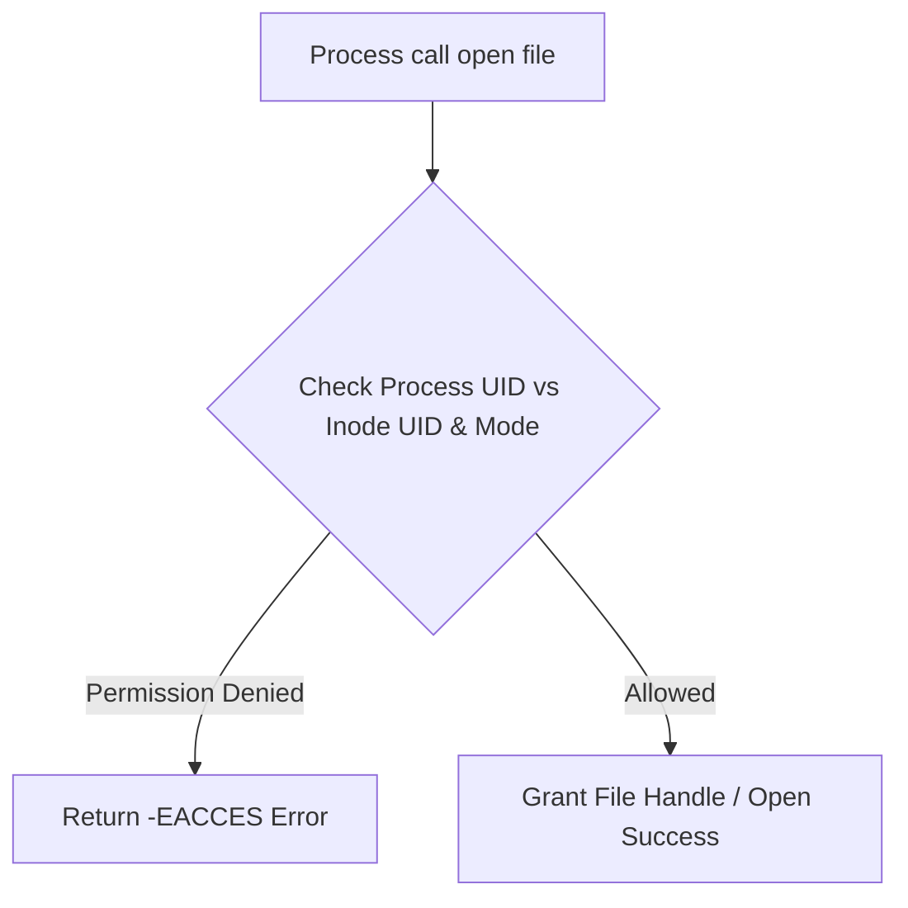
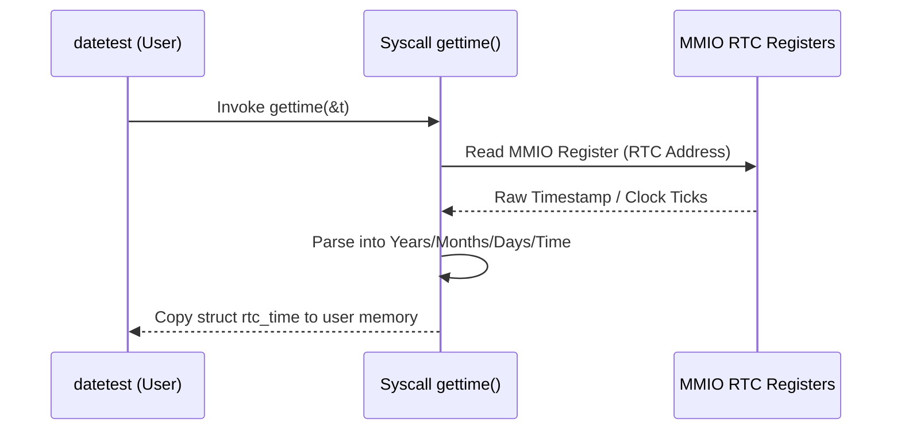
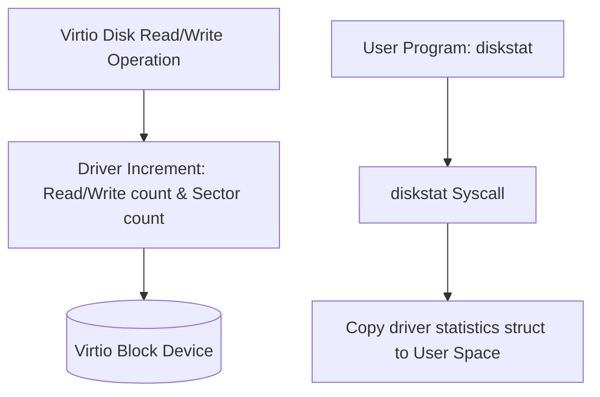
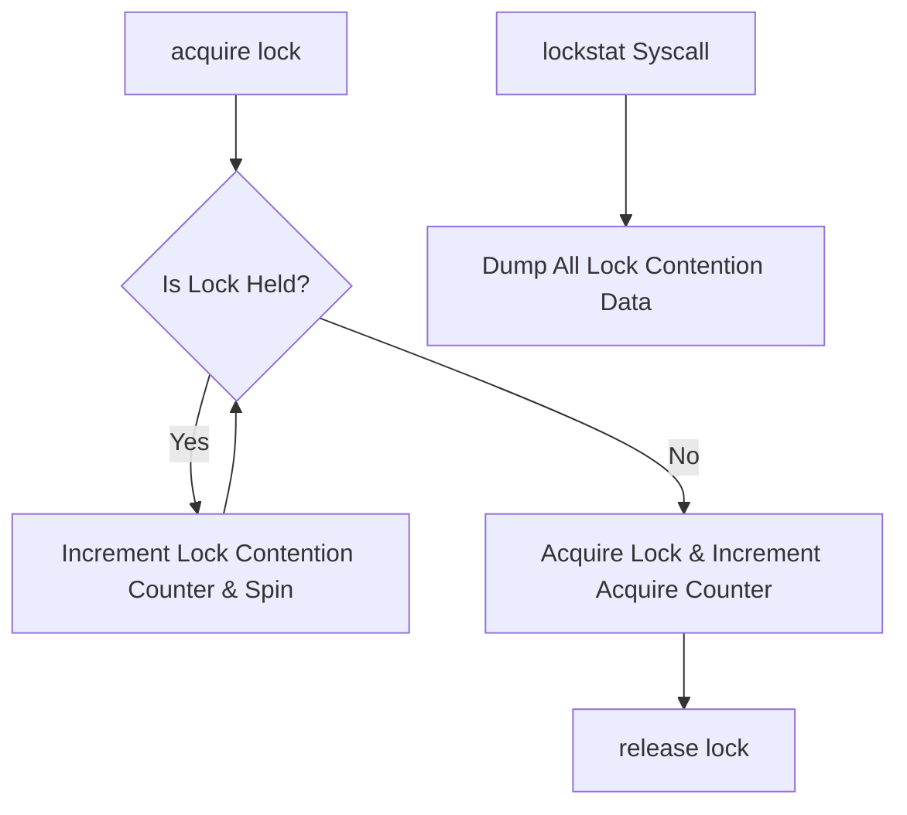
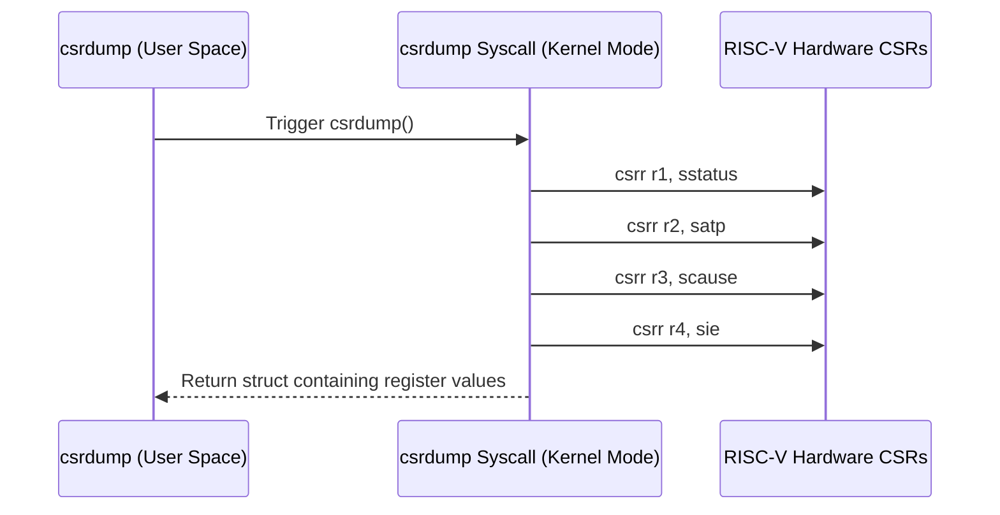
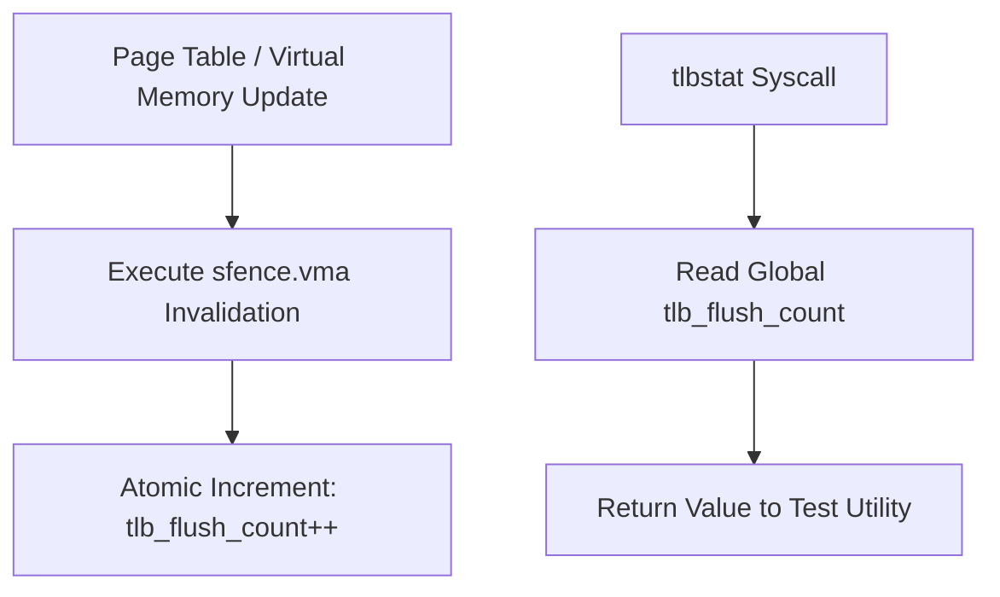

# Kernel-Extend-Project

## Student Information

**Name:** Manahil Rehman
**Roll No:** BCS-F24-E09

**Project:** Operating System/ Computer Archeitecture Kernel Extension

**Base Kernel:** xv6-riscv

---

## Selected Modules

The following modules have been selected for my kernel extension project.

### Part 1: OS Modules — Multitasking

| # | Module | Subsystem | Syscalls | Test Program | Difficulty |
|---|--------|-----------|----------|--------------|------------|
| 1 | **Process Pause/Resume** | Process States | `pause_proc()`, `resume_proc()` | `pausetest` | Easy-medium |
| 2 | **Shared Memory** | Pages Mapped into Two Processes | `shmget()`, `shmat()`, `shmdt()` | `shmtest` | Medium |
| 3 | **File Descriptor Info** | Open-File Table | `fdinfo()` | `fdinfo` | Easy |
| 4 | **Kernel Log Buffer (dmesg)** | Kernel Logging | `klog()` | `dmesg` | Easy-medium |
| 5 | **User IDs and File Permissions** | Access Control | `setuid()`, `getuid()`, `chmod()` | `permtest` | Medium |

### Part 2: Architecture Modules — RISC-V

| # | Module | Subsystem | Syscalls | Test Program | Difficulty |
|---|--------|-----------|----------|--------------|------------|
| 6 | **Real-Time Clock** | Memory-Mapped I/O (QEMU RTC) | `gettime()` | `datetest` | Easy-medium |
| 7 | **Virtio Disk Statistics** | Disk Driver | `diskstat()` | `diskstat` | Easy |
| 8 | **Lock Statistics** | Atomics and Spinlocks | `lockstat()` | `lockstattest` | Medium |
| 9 | **CSR Dump** | Supervisor CSRs (`sstatus`, `satp`, `scause`, `sie`) | `csrdump()` | `csrdump` | Easy |
| 10 | **TLB Flush Counter** | `sfence.vma` and Address Translation | `tlbstat()` | `tlbstat` | Medium |

---

## Module Reservation

**These 10 modules are reserved for my kernel extension project.**

Implementation, testing, documentation, and architectural diagrams will be added in later stages.

# Detailed Module Specifications & Flow Diagrams

---

## Module 1: Process Pause/Resume
* **Subsystem:** Process States
* **Syscalls:** `pause_proc()`, `resume_proc()`
* **Test Program:** `pausetest`
* **Difficulty:** Easy-medium

### Explanation & Key Features
* **Overview:** Process ki execution ko temporary tor par rokne (pause) aur baad mein dubara chalanay (resume) ke liye process state (`PAUSED`) ka addition.
* **Key Features:**
  * Process table structure mein `PAUSED` naam ki nayi state add ki gayi hai.
  * `pause_proc(pid)` system call process ko `RUNNING`/`RUNNABLE` se `PAUSED` state mein shift karti hai aur scheduler ko call karti hai.
  * `resume_proc(pid)` system call process ko `PAUSED` se wapas `RUNNABLE` state mein laati hai.
  * Kernel context mein deadlock se bachne ke liye safe execution control.

### Flow Diagram

---

## Module 2: Shared Memory
* **Subsystem:** Pages Mapped into Two Processes
* **Syscalls:** `shmget()`, `shmat()`, `shmdt()`
* **Test Program:** `shmtest`
* **Difficulty:** Medium

### Explanation & Key Features
* **Overview:** Do ya ziada alag processes ko fast Inter-Process Communication (IPC) ke liye same physical memory pages share karne ki ijazat deta hai.
* **Key Features:**
  * Shared physical memory pages ka allocation jo alag processes ke user address space mein map hote hain.
  * Page table updating taakay alag page tables aik hi physical frame ko point karein.
  * Reference counting taakay jab tamam processes detach ho jayein to physical page free ho jaye.

### Flow Diagram

---

## Module 3: File Descriptor Info
* **Subsystem:** Open-File Table
* **Syscalls:** `fdinfo()`
* **Test Program:** `fdinfo`
* **Difficulty:** Easy

### Explanation & Key Features
* **Overview:** Target process ke active file descriptors ko inspect karta hai taakay diagnostics aur system inspection ho sakay.
* **Key Features:**
  * Open file descriptors, offsets, flags, aur file types (pipe, inode, device) ko read karta hai.
  * System call `fdinfo(fd, struct fd_info *info)` user-space structure ko populate karti hai.
  * Userland applications mein file resource leaks ko debug karne ke liye use hota hai.

### Flow Diagram

---

## Module 4: Kernel Log Buffer (dmesg)
* **Subsystem:** Kernel Logging
* **Syscalls:** `klog()`
* **Test Program:** `dmesg`
* **Difficulty:** Easy-medium

### Explanation & Key Features
* **Overview:** Kernel ke andar circular ring buffer implement karta hai jo debugging messages aur logs ko store karta hai.
* **Key Features:**
  * Ring buffer implementation (`LOG_SIZE`) jo memory overflow se bachata hai.
  * Kernel `printf` calls ko intercept kar ke messages ko kernel log buffer mein copy karta hai.
  * `klog(buf, size)` system call userland `dmesg` utility ko logs expose karti hai.

### Flow Diagram

---

## Module 5: User IDs and File Permissions
* **Subsystem:** Access Control
* **Syscalls:** `setuid()`, `getuid()`, `chmod()`
* **Test Program:** `permtest`
* **Difficulty:** Medium

### Explanation & Key Features
* **Overview:** Multi-user context aur POSIX-style file access permission controls introduce karta hai.
* **Key Features:**
  * Har process ke pass execution state mein `uid` track hota hai.
  * File inodes owner UID aur permission mode flags (`rwx` bits) store karti hain.
  * File open, read, write aur execute operations ke waqt access check enforce hota hai.

### Flow Diagram

---

## Module 6: Real-Time Clock
* **Subsystem:** Memory-Mapped I/O (QEMU RTC)
* **Syscalls:** `gettime()`
* **Test Program:** `datetest`
* **Difficulty:** Easy-medium

### Explanation & Key Features
* **Overview:** QEMU RISC-V platform ke MMIO Real-Time Clock hardware registers ke sath interface karta hai.
* **Key Features:**
  * Memory space mein mapped hardware clock registers ko read karta hai.
  * System call `gettime(struct rtc_time *t)` wall-clock hardware timestamp fetch karti hai.
  * System clock ticks ko human-readable date/time metrics mein convert karta hai.

### Flow Diagram

---

## Module 7: Virtio Disk Statistics
* **Subsystem:** Disk Driver
* **Syscalls:** `diskstat()`
* **Test Program:** `diskstat`
* **Difficulty:** Easy

### Explanation & Key Features
* **Overview:** Storage subsystem performance ko measure karne ke liye Virtio block device usage metrics ko track karta hai.
* **Key Features:**
  * Total read/write request counts, total sectors transferred, aur I/O errors track karta hai.
  * `diskstat(struct disk_stats *st)` system call driver metrics ko test program tak pohanchati hai.

### Flow Diagram

---

## Module 8: Lock Statistics
* **Subsystem:** Atomics and Spinlocks
* **Syscalls:** `lockstat()`
* **Test Program:** `lockstattest`
* **Difficulty:** Medium

### Explanation & Key Features
* **Overview:** Kernel synchronization locks (spinlocks/sleep-locks) ki performance aur contention ko monitor karta hai.
* **Key Features:**
  * Har lock ki acquisition counts, spin-loop contention iterations, aur hold time monitor karta hai.
  * Kernel concurrency bottlenecks aur race conditions pehchanne mein madad karta hai.
  * System call `lockstat()` lock contention counters ko user space mein dump karti hai.

### Flow Diagram

---

## Module 9: CSR Dump
* **Subsystem:** Supervisor CSRs (`sstatus`, `satp`, `scause`, `sie`)
* **Syscalls:** `csrdump()`
* **Test Program:** `csrdump`
* **Difficulty:** Easy

### Explanation & Key Features
* **Overview:** RISC-V Supervisor mode ke Control and Status Registers (CSRs) ko privilege level diagnostics ke liye read karta hai.
* **Key Features:**
  * Inline assembly (`csrr`) ka istemal kar ke `sstatus`, `satp`, `scause`, `stval`, aur `sie` read karta hai.
  * Kernel trap handling, page table switching (`satp`), aur interrupt masking (`sie`) ko debug karne mein madad karta hai.

### Flow Diagram

---

## Module 10: TLB Flush Counter
* **Subsystem:** `sfence.vma` and Address Translation
* **Syscalls:** `tlbstat()`
* **Test Program:** `tlbstat`
* **Difficulty:** Medium

### Explanation & Key Features
* **Overview:** `sfence.vma` execution se trigger hone wali Translation Lookaside Buffer (TLB) invalidation calls ko count karta hai.
* **Key Features:**
  * Virtual memory address space invalidations ko kernel memory management mein hook karta hai.
  * Jab bhi virtual memory mapping change hoti hai, atomic counter increment hota hai.
  * System call `tlbstat()` global TLB flush metrics return karti hai.

### Flow Diagram

